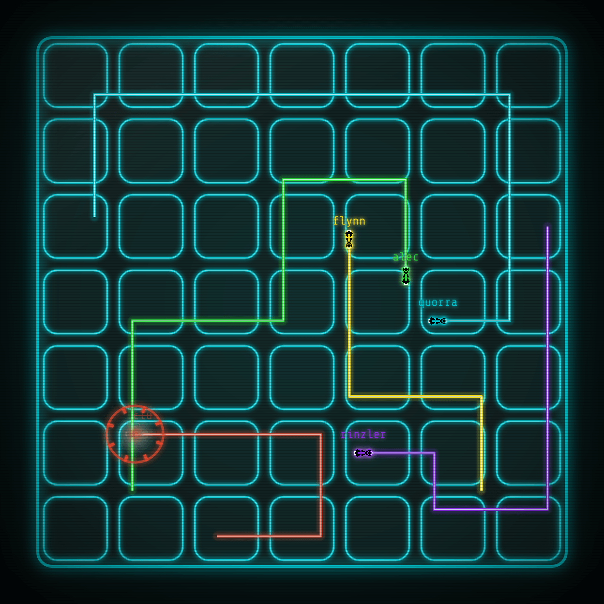

# 

Una implementación multijugador basada en navegador del clásico juego arcade Tron Lightcycles.

## Construir el binario del servidor desde el código fuente

1. Instala [bun](https://bun.sh) para compilar el cliente web empaquetado.
1. Instala [rustup](https://www.rust-lang.org/tools/install).
1. Instala la última toolchain estable de Rust con `rustup toolchain install stable`.
1. Clona el proyecto localmente con `git clone git@github.com:alecdwm/webtron.git`.
1. Cambia al directorio clonado con `cd webtron`.
1. Compila el proyecto con `cargo build --release`.

El binario del servidor se encontrará en `target/release/webtron`.

## Ejecutar el servidor en desarrollo

1. Instala [cargo-watch](https://github.com/passcod/cargo-watch).
1. Clona el proyecto localmente con `git clone git@github.com:alecdwm/webtron.git`.
1. Cambia al directorio clonado con `cd webtron`.
1. Ejecuta el servidor (y reinícialo automáticamente cuando haya cambios en el código) con `cargo watch -i 'client/**' -x fmt -x run`.
   - Si no tienes `cargo-watch`, puedes instalarlo con `cargo install cargo-watch`
1. En otra terminal, cambia al subdirectorio del cliente con `cd webtron/client`.
1. Ejecuta el servidor de desarrollo del cliente con `bun dev`.

El cliente web estará disponible en [http://localhost:3000](http://localhost:3000).
