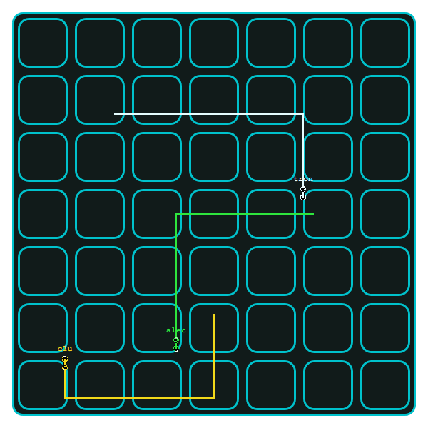

# 
A browser-based multiplayer implementation of the classic Tron Lightcycles arcade game.

## Building the server binary from source
1. Install [nodejs](https://nodejs.org) and [yarn](https://yarnpkg.com) for building the bundled web client.
1. Install [rustup](https://www.rust-lang.org/tools/install).
1. Install the latest stable rust toolchain with `rustup toolchain install stable`.
1. Clone the project locally with `git clone git@github.com:alecdwm/webtron.git`.
1. Change to the cloned directory with `cd webtron`.
1. Build the project with `cargo build --release`.

The server binary will be located at `target/release/webtron`.

## Running the server in development
1. Install [cargo-watch](https://github.com/passcod/cargo-watch).
1. Clone the project locally with `git clone git@github.com:alecdwm/webtron.git`.
1. Change to the cloned directory with `cd webtron`.
1. Run the server (and automatically restart it on code changes) with `cargo watch -i 'client/**' -x fmt -x run`.
1. In another terminal, change to the client subdirectory with `cd webtron/client`.
1. Run the client development server with `yarn dev`.

The web client will be available at [http://localhost:3000](http://localhost:3000).
